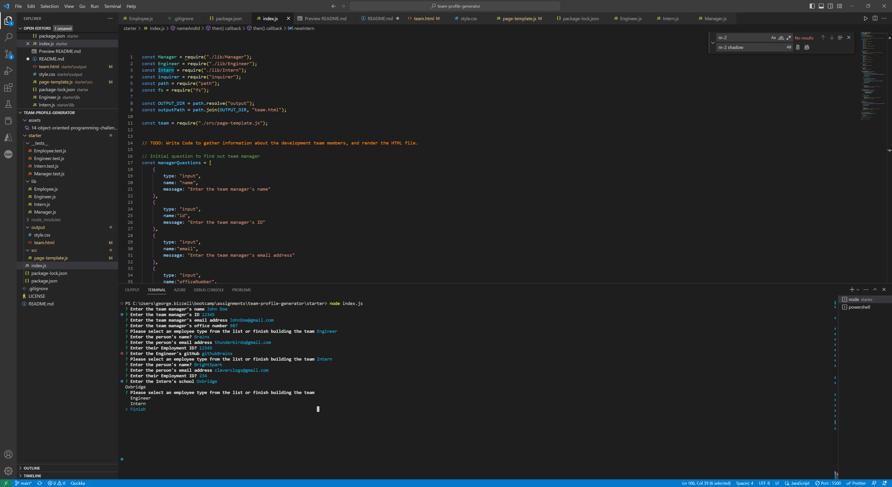
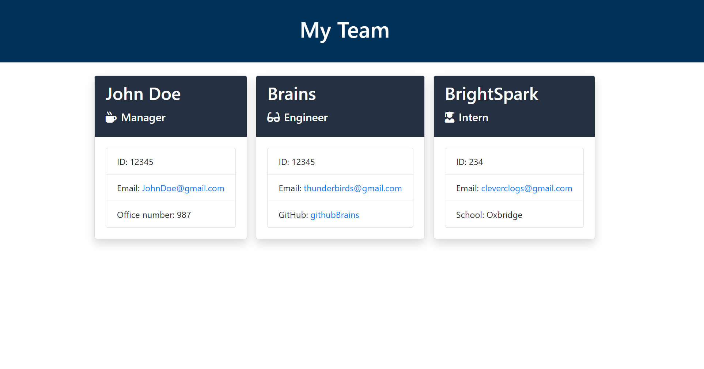

  # Team profile generator :raised_hands:

  

  

  

  ## Table of Contents
  - [Description](#description)
  - [Installation](#installation)
  - [Usage](#usage)
  - [License](#license)
  - [Contributing](#contributing)
  - [Tests](#tests)
  - [Questions](#questions)

  ## Description
  
  Team Profile Generator is a command line javascript application that uses Node.js to generate team profiles on a HTML page. The user is prompted to input content for the team and the HTML file is written by the application.

  ## Installation 

  Install Node.js on your system. Open the Team Profile generator application via the command line or in visual studio. Enter 'node index.js' into the command line and hit enter. 

  ## Usage 

  Enter node index.js into the command line. Answer the prompts and press enter each time. The HTML will generate and save to the "output" folder.

  * Add the details for the Team Manager.

  * Add any further Engineer or Intern team members.

  * When complete, select Finish and the HTML will generate.
  
  ## Contributing 

  Others can contribute by git pulling the repository, creating a new branch with a new feature, before committing the new feature branch. A peer will then review before pushing to main.
  
  ## Tests

  This application uses Jest tests.

  * To run the Jest tests, the user must first install Jest by entering 'npm i jest' into the command line.

  * The tests can then be run by entering 'node test'.

  * The tests will run and report successes and failures. When pushed by the author, all tests were passing.
     
  ## Questions
  
  Check out my Github [github.com/georgebizzell](https://www.github.com/georgebizzell)

  Feel free to get in touch via email! <a href="mailto:bootcamp_coder@hotmail.com">bootcamp_coder@hotmail.com</a>;

  ## License

  

  Usage and distribution of this application is governed by the MIT license. <https://opensource.org/licenses/MIT>
